# TP1DPBO2425C2

Saya Fauzia Rahma Nisa mengerjakan Tugas Praktikum 1 dalam mata kuliah Desain dan Pemrograman 
Berdasarkan Objek untuk keberkahanNya maka saya tidak melakukan kecurangan seperti yang telah 
dispesifikasikan. Aamiin.

A. Desain Kode

   Program ini dibuat menggunakan konsep OOP (Object-Oriented Programming). Kelas produk_elektronik menjadi inti dari program, yang memiliki atribut seperti nama, kode (unik untuk tiap produk), merk, warna, stok dan image (di PHP). Kelas ini menyediakan getter dan setter untuk masing-masing atribut agar data bisa diakses dan diubah secara aman, serta metode tampilkan_data() untuk menampilkan informasi produk.

   Semua produk disimpan dalam array statis daftar dengan kapasitas maksimum MAKS (255 produk), dan variabel global jumlah digunakan untuk menyimpan jumlah produk saat ini. Selain itu, terdapat beberapa fungsi di luar kelas untuk melakukan operasi CRUD: tambah_data(), tampilkan_semua(), update_data(), hapus_data(), dan cari_data(). Fungsi cari_index_kode() juga disediakan untuk mempermudah pencarian indeks produk berdasarkan kode unik.

B. Alur Program (Flow Kode)

   Program dimulai dari fungsi main(), yang menampilkan menu perintah CRUD berulang kali dalam sebuah loop utama hingga pengguna memilih untuk keluar. Pada loop ini, pengguna diminta memasukkan perintah, seperti Tambah, Tampilkan, Update, Hapus, Cari, atau Keluar.

- Tambah Data: Program meminta input semua atribut produk, memeriksa apakah kode produk sudah ada, dan jika kode unik,
  menambahkan produk baru ke array daftar dan menambah jumlah.
- Tampilkan Semua Data: Program memeriksa apakah ada produk yang tersimpan. Jika ada, program akan menampilkan semua produk
  satu per satu dengan nomor urut.
- Update Data: Program meminta kode produk yang ingin diubah, mencari indeksnya, lalu meminta input data baru untuk atribut
  produk yang bersangkutan. Setelah itu, data produk diarray diperbarui.
- Hapus Data: Program meminta kode produk yang ingin dihapus, mencari indeksnya, lalu menghapus produk dari array dengan
  menggeser semua elemen setelahnya ke kiri dan mengurangi jumlah.
- Cari Data: Program meminta kode produk, mencari produk di array, dan menampilkan informasi produk jika ditemukan. Jika
  tidak ditemukan, menampilkan pesan error.
- Keluar: Program menghentikan loop utama dan menampilkan pesan selesai, lalu program berakhir.

   Setiap operasi CRUD selalu menampilkan pesan konfirmasi untuk memberi feedback kepada pengguna, misal “Data produk berhasil ditambahkan” atau “Produk tidak ditemukan”. Dengan alur ini, program memungkinkan pengguna untuk mengelola data produk elektronik secara interaktif dalam satu sesi.

C. Sceenshot Output

- CPP

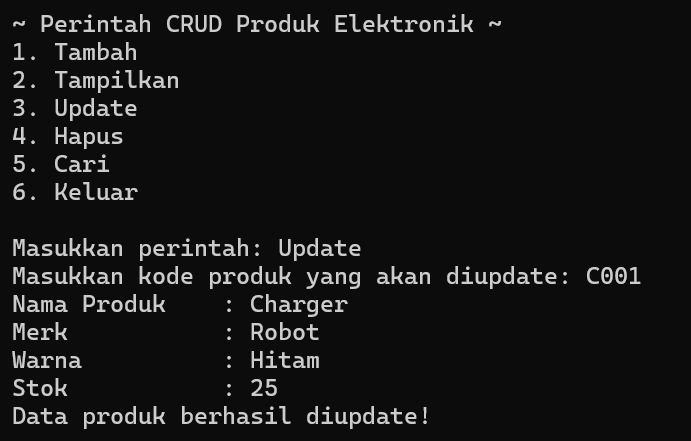
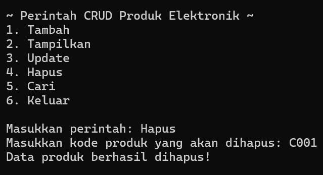
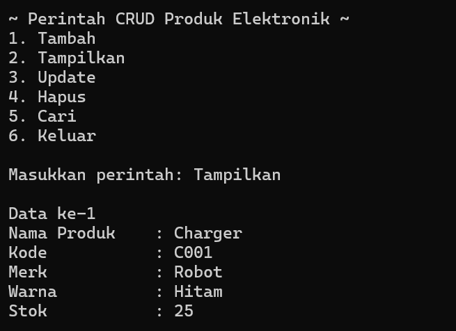
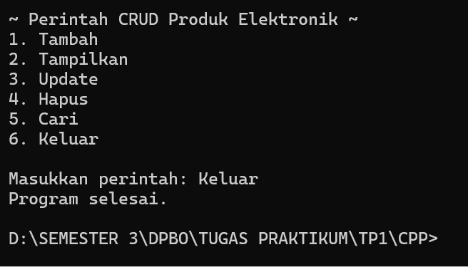

- PYTHON
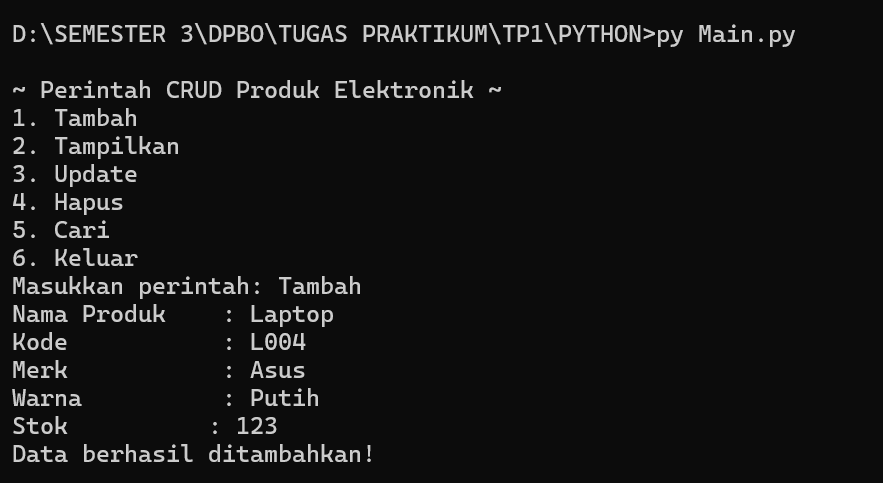
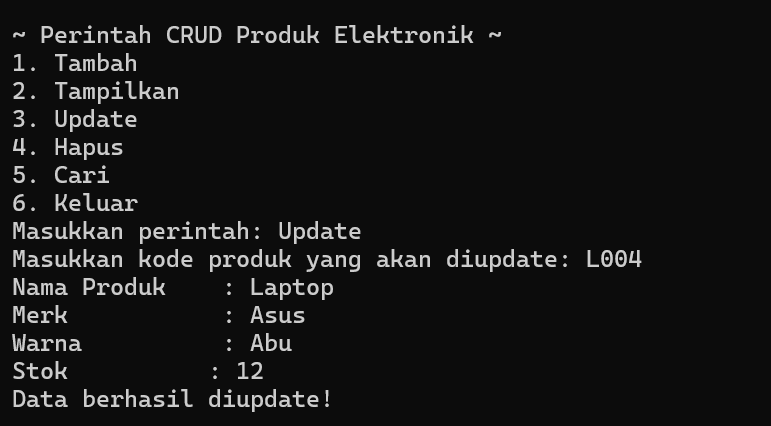
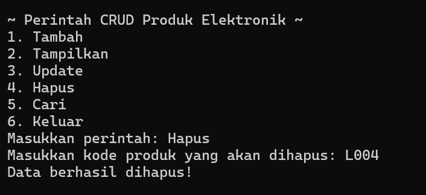
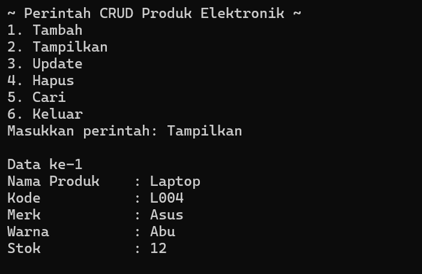
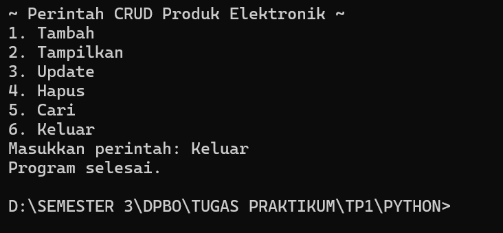

- JAVA
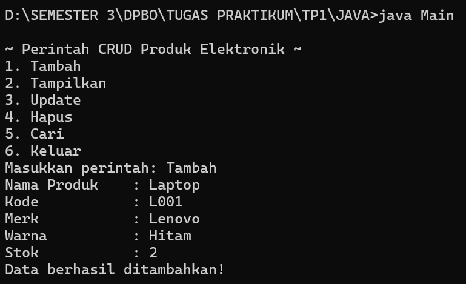
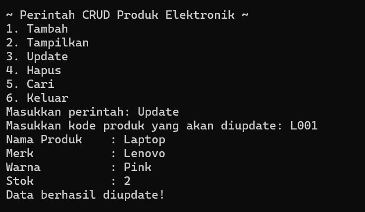
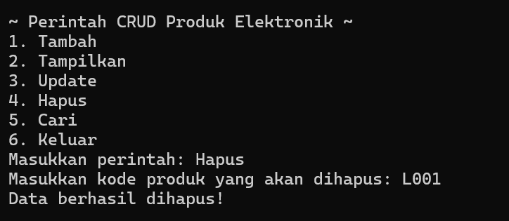
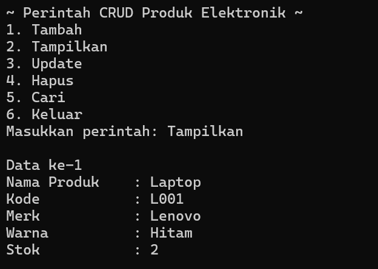
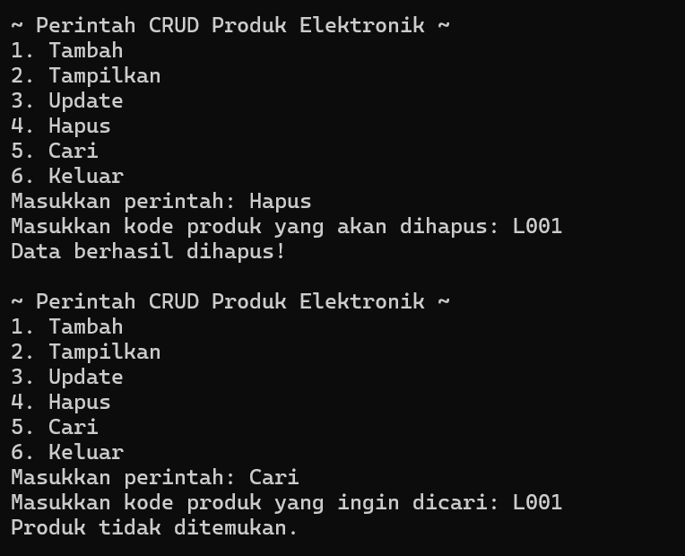
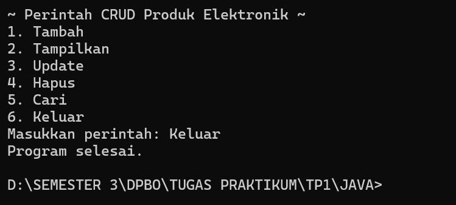

- PHP
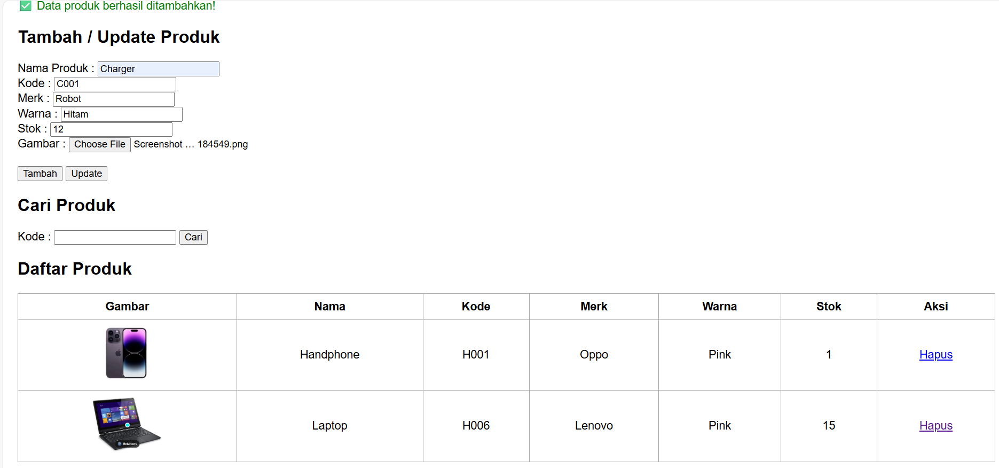
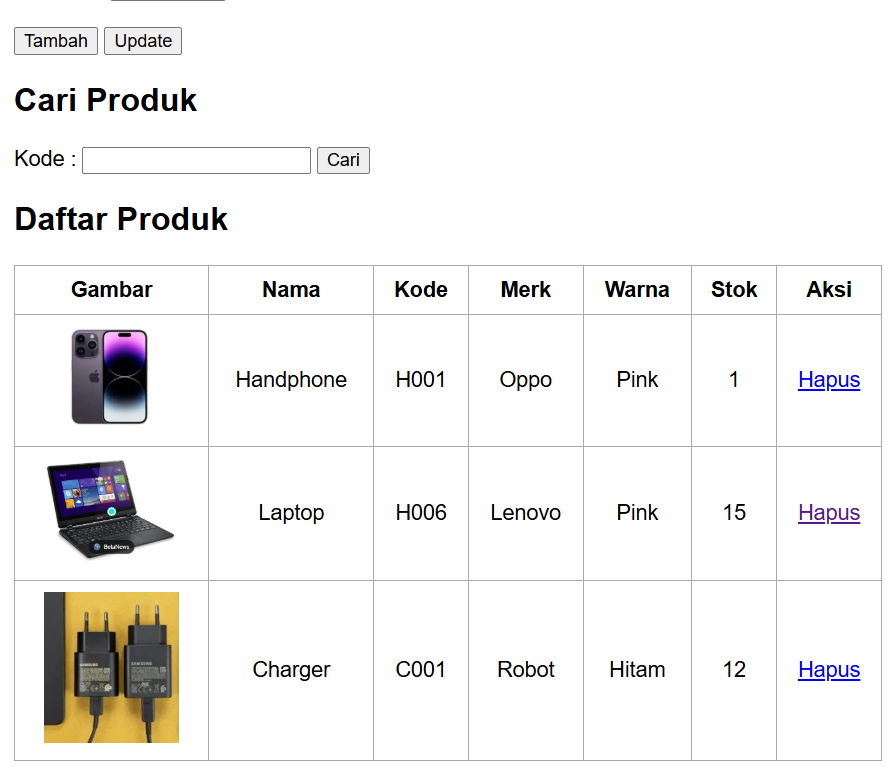
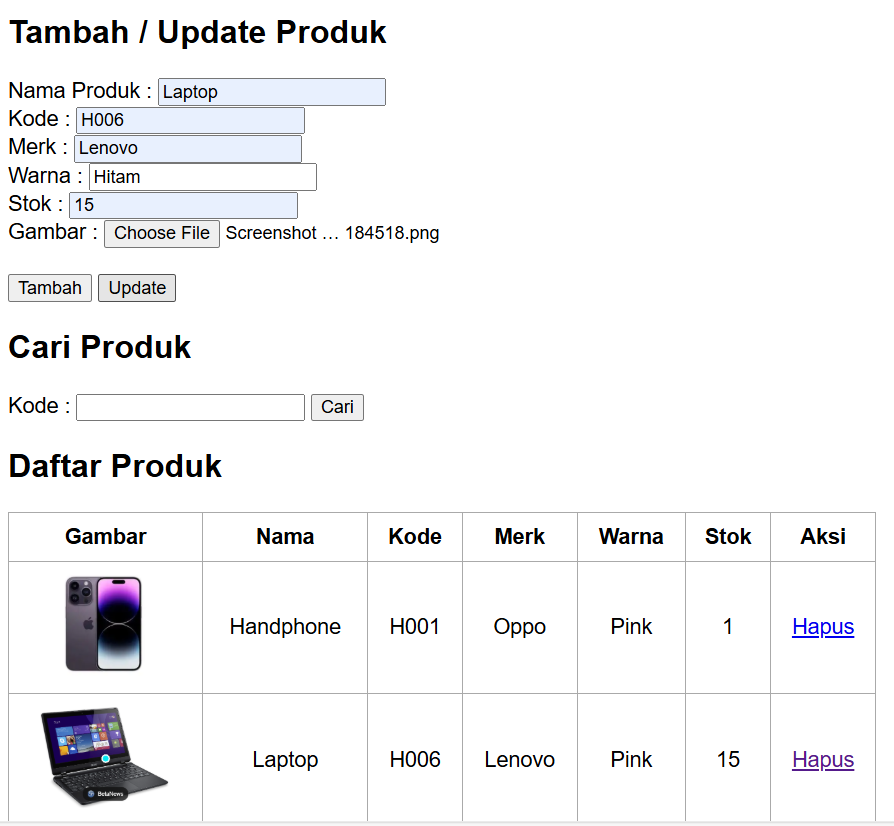
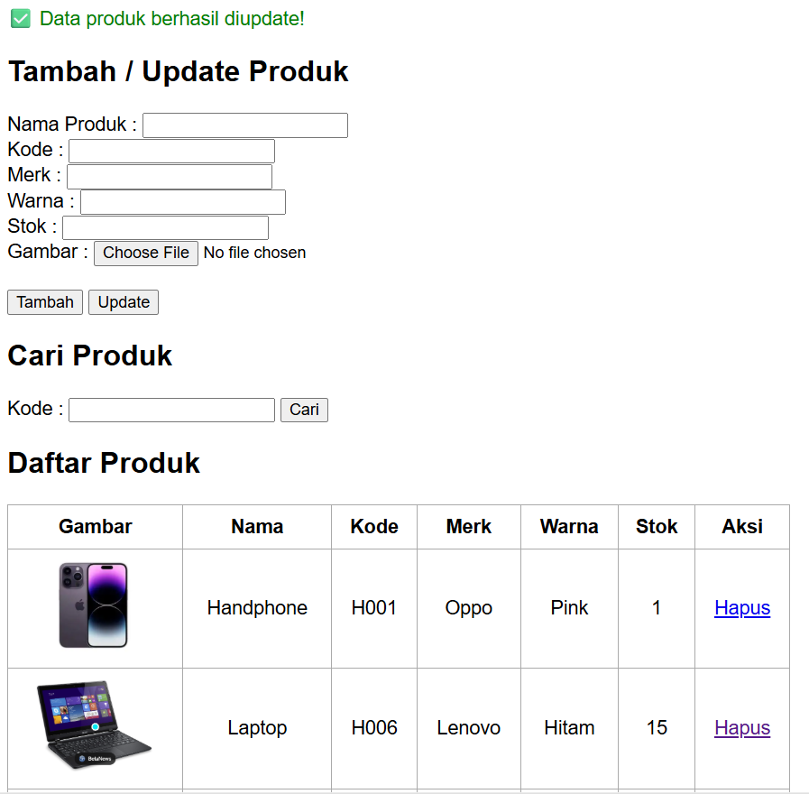
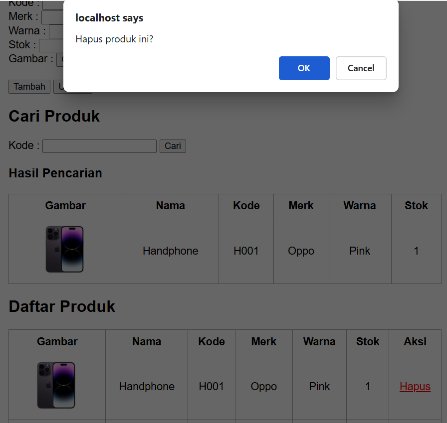
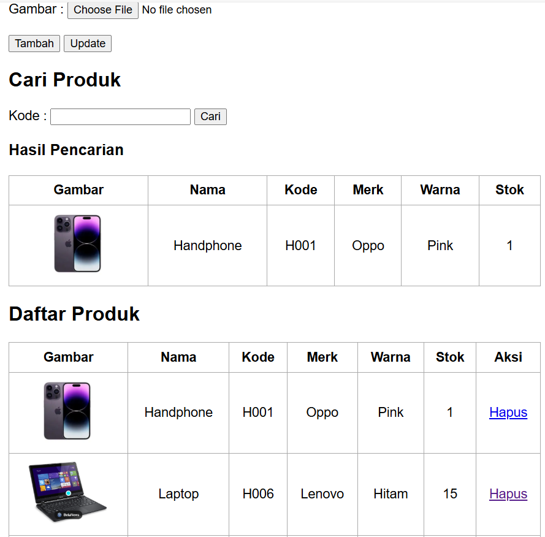

